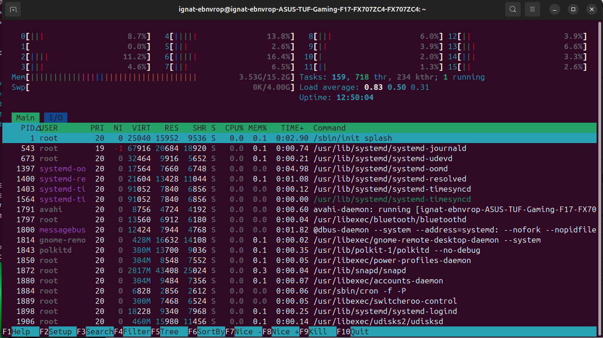

# This is my linux summary 

Линукс это **ядро** которое является основой для всех дистрибутивов которые в свою 
очередь являются полноценными операционными системами
Ядро служит переходником между железом (аппаратным обеспечением) и пользовательскими
процессами. 

Ядро управляет 4-мя главными ресурсами компьютера:
1. Управление процессами:
  * Ядро управляет переключением контекста:
    Во время выполнения одного процесса ядро следит за временным квантом и когда 
    он истекает ->ядро запоминает текущее сосотояние пк (память и тд)->выполняет        
    те операции которые были заданы за прошлый временной квант ->анализирует список
    процессов и выбирает один из них ->подготавливает память для след. процесса->
    сообщает процессору длительность временного кванта->передает управление

2. Управление памятью
3. Управление устройствами 
4. Управление файловой системой

Ядро отвечает за то чтобы разные программы и процессы не конфлик
товали между собой. Оно отвечает за расспределение памяти под разные процессы. 
Объясняет компьютеру как работать с видеокартой,клавиатурой,wi-fy модулем и др.
Отвечает за чтение и запись байтов на SSD или жесткий диск.

Введя в терминале команду htop мы можем увидеть интерактивную схему работы процессора

На ней видно:
 * 16 ядер (от 0 до 15) и % нагрузки каждого ядра. 
 * Mem всю оперативную память и занятую ее часть.
 * Tasks- все зарегестрированные в системе процессы 
 * Thr- колличество потоков (подзадачи от зарег. процессов)
 * kthr- колличество потоков которые запущены самим ядром для внутренних служб
 * running-колличество задач которые прямо сейчас используют процессор
 * load everage- средняя нагрузка за последние (5,10,15 мин)
 ++++
Ядро Linux поддерживает традиционую концепцию пользователей Unix.Пользоваать это сущность которая может выполнять запускать процессы и владеть файлами.То есть пользователь это набор процессов относящихся к нему.Ядро различает пользователей по их ID. Пользователь не может лезть в процессы других пользователей.

23.06.26

 На этом этапе не считая того что я писал выше  я ознакомился с:
 - стандартными командами оболочки Unix. Такими как cp,touch,rm,ls,cd,mkdir,rmdir и др.
 Также команды могут сопровождаться аргументами которые идут после самой команды (ls -l, cat file_1, cp file_1 dir_1,touch file_1 file_2 file_3 .)
 - с стандартным потоком ввода (stdin) и ввывода (stdout) они могут считывать и записывать данные.Они считывают данные с входных потоков и записывают дынные в выходные потоки.
 - перемещение по каталогам (cd и пути)
 - шаблоны поиска такие как * и ? (echo * выведет все файлы в текущей дериктории, ?- дополняет один пропущеный символ)
 

26.06.26 
У стандартных потоков есть свои числовые дискрипторы stdin(0),stdout(1),stderr(2)
Их можно использовать для перенаправления вывода/ввода или офибки 
Например можно распределить ошибки и информацию в разные файлы так:find -type f 1>results.txt 2>errors.txt
Пример перенаправления потока ввода :head > /proc/cpuinfo то есть мы передаем вместо файла, готовый текст это хорошо подходит для комманд 
которые не могут принимать в качестве параметра файл

29.06.26
Чтобы найти команду для запуска программы через терминал (telegram) есть несколько способов:
- Поиск через tab: можно написать tele +tab tab команда может подобраться автоматически
- Поиск по ярлыкам. Так как все графические программы создают ярлыки в системе (.desctop файлы)
используем команду grep -E '^Exec=' /usr/share/applications/*.desktop /var/lib/snapd/desktop/applications/*.desktop 2>/dev/null | grep -i telegram
то есть ищем файл .desctop в двух каталогах.
